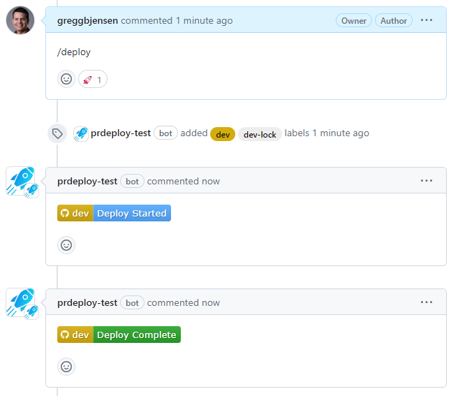

Within the pull request, engineers, QA, and the product owner can work together using **prdeploy** comments as commands to progress the feature to production.  The intent is for the full lifecycle of development to take place within the pull request, cleaning up all bugs before merging to the `main` branch.  This makes sure each pull request is clean of bugs and the testing scope is small.

{: style="margin: 40px 0 10px 0;"}

## Comment Commands

| Command                                              | Description                                                                                                                         |
| ---------------------------------------------------- | ----------------------------------------------------------------------------------------------------------------------------------- |
| `/deploy` `/deploy dev`                           | Deploy to first available dev environment or get added to queue.                                                                    |
| `/deploy stage`                                      | Deploy to stage environment or get added to queue.                                                                                  |
| `/deploy prod`                                       | Deploy to prod environment or get added to queue.                                                                                   |
| `/deploy dev2 --force` `/deploy stage --force`    | Override deploy to a specific dev, stage, or prod environment and skip the queue.                                                   |
| `/deploy stage --retain` `/deploy prod --retain`  | Promote pull request to next environment, but retain the lock on the current one as well. Can also be used with --force.            |
| `/free`                                              | Remove lock on all deployed environments for others to use it.                                                                      |
| `/free stage`                                        | Remove lock on specified environment only for others to use it.                                                                     |
| `/rollback`                                          | Rollback current locked environment to the previous version. If there are multiple environments locked, you must specify which one. |
| `/rollback prod` `/rollback stage`                | Rollback a specific environment to the previous version. You must have a lock on an environment to roll it back.                    |
| `/rollback prod 2`                                   | Rollback a specific environment multiple versions in history.                                                                       |
| `/add mydomain-api-service mydomain-app-main`        | Add services to be built and deployed with the pull request that have no code changes.                                              |