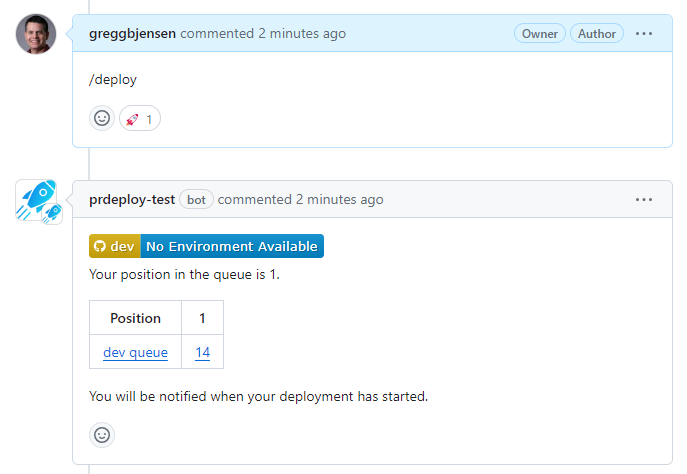
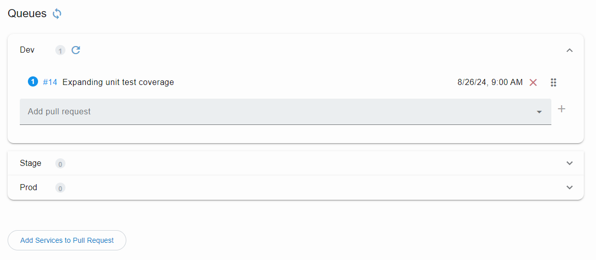

The **prdeploy** app keeps on pull request per environment, to minimize the changes needed to test and keep deployments running quickly.  Because there can be multiple engineers working from the same repository and set of services, if an envirionment is in use, a pull request will be added to the queue and then deployed automatically when the environment is free.

## Queue status comment

If a queue is in use, your deployment will be placed in line and automatically deployed when the environment is free.

{: style="margin: 50px 0 0 0;"}

## Queue management

You can use the **prdeploy** portal to reorder queue for priority, as well as add and remove pull requests.

{: style="margin: 30px 0 20px 0;"}