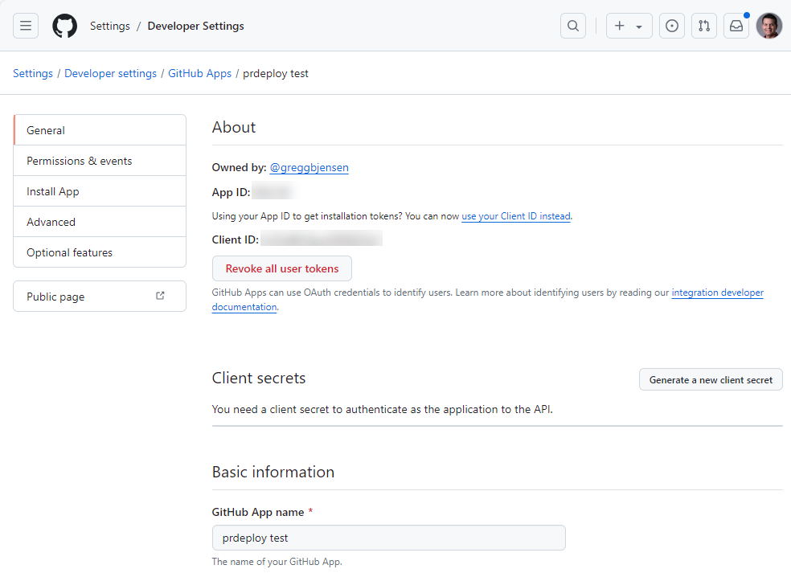
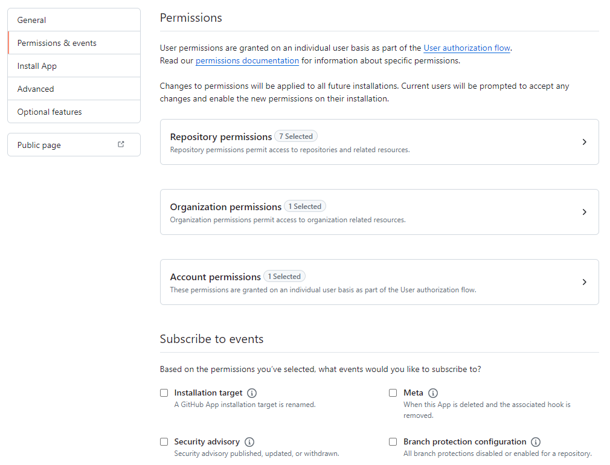

In order to be able to listen and respond to pull request events, we need to create a GitHub App for prdeploy.

## 1. Create GitHub App


{: style="margin: 30px 0 60px 0; box-shadow: rgba(0, 0, 0, 0.2) 0px 3px 3px -2px, rgba(0, 0, 0, 0.14) 0px 3px 4px 0px, rgba(0, 0, 0, 0.12) 0px 1px 8px 0px;"}

1. Navigate to [https://github.com](https://github.com) and sign in.
2. Click on your profile photo in the top right and choose **Your Organizations**.
3. Click on the organization you want to add **prdeploy** to.
4. Select the **Settings** tab, expand **Developer settings** on the left nav and choose **GitHub Apps**.
5. Click **New GitHub App** in the top right.
6. Fill in at least the following information:

    | Field           | Value                                                                       |
    | --------------- | --------------------------------------------------------------------------- |
    | GitHub App Name | prdeploy myorg                                                              |
    | Description     | Allows the entire build-deploy lifecycle to happen within a feature branch. |
    | Homepage URL    | https://prdeploy.myorg.com                                                  |
    | Webhook URL     | https://prdeploy.myorg.com/webhooks                                         |
    | Secret          | _Any secure set of characters (see below)._                                 |

    Generating a secret with Node:

    ```bash
    node -e "console.log(require('crypto').randomBytes(64).toString('base64'));"
    ```

    Make sure to copy the **Secret** set above into your notes for use with AWS Parameter Store.

## 1. Configure permissions and events

1. Set each of the **Permissions** as follows:


{: style="margin: 30px 0 60px 0; box-shadow: rgba(0, 0, 0, 0.2) 0px 3px 3px -2px, rgba(0, 0, 0, 0.14) 0px 3px 4px 0px, rgba(0, 0, 0, 0.12) 0px 1px 8px 0px;"}

**Repository Permissions**

| Scope          | Permission     |
| -------------- | -------------- |
| Actions        | Read and write |
| Administration | Read-only      |
| Checks         | Read-only      |
| Contents       | Read and write |
| Issues         | Read-only      |
| Metadata       | Read-only      |
| Pull requests  | Read and write |

  **Organization Permissions**

| Scope   | Permission |
| ------- | ---------- |
| Members | Read-only  |

**Account Permissions**

| Scope           | Permission |
| --------------- | ---------- |
| Email addresses | Read-only  |

2. Subscribe to the following events:

```
Issue comment
Pull request
Workflow run
```

3. **Where can this GitHub App be installed?** should be set to **Only on this account**.
4. Click **Create GitHub App**.

## 2. Display information

1. Scroll to the bottom of the GitHub App **About** page.
2. Under **Display information** click on **Upload a logo...**.
3. Download and select the file from `https://github.com/greggbjensen/prdeploy/blob/main/docs/assets/images/logo-128x128.png`.

## 3. Credentials and private key

1. From the top of the page add the following to your notes for use with AWS Parameter Store:
    * App ID
    * Client ID

2. At the bottom of the page click on **Generate a private key**.
3. A `.pem` file will automatically download, remember this file location for AWS Parameter Store.

## 4. Install App
1. Click on **Install App** on the left nav.
2. Click **Install** to the right of your organization.
3. Select **Only select repositories**.
4. From the drop down, choose each repository you want to use **prdeploy** with.
5. Click **Install**.

[Next step - 2. GitHub OAuth App](./2-github-oauth-app.md)