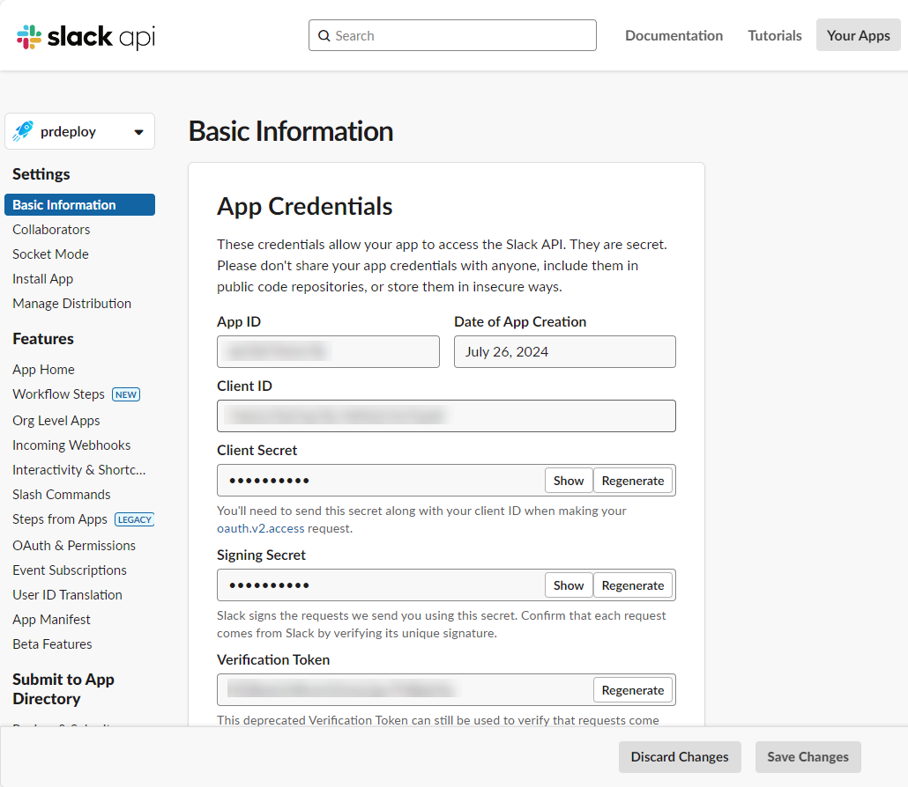
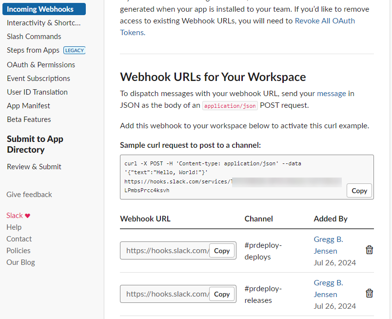

The prdeploy app is able to post deployment and release notifications to Slack as well as tag the person they are for to keep development moving quickly.

- Deployments - A quick summary for any environment a deployment completes in.
- Releases - The full detail of a pull request when it is release to production.

## 1. Create Slack App


{: style="margin: 30px 0 60px 0; box-shadow: rgba(0, 0, 0, 0.2) 0px 3px 3px -2px, rgba(0, 0, 0, 0.14) 0px 3px 4px 0px, rgba(0, 0, 0, 0.12) 0px 1px 8px 0px;"}

1. Navigate to [https://api.slack.com/apps](https://api.slack.com/apps).
2. Click on **Create New App** and choose **From scratch**.
3. In **App Name** type `prdeploy`.
4. Under **Pick a workspace to develop your app in:** select your Slack organization.
5. Click **Create App**.

## 2. Display information

1. Scroll to **Display Information** at the bottom of the page.
2. Enter the following information:

| Field             | Value                                                                                                                                                                                                                 |
| ----------------- | --------------------------------------------------------------------------------------------------------------------------------------------------------------------------------------------------------------------- |
| Aopplication name | prdeploy                                                                                                                                                                                                              |
| Short Description | Allows the entire build-deploy lifecycle to happen within a feature branch.                                                                                                                                           |
| Background color  | #1192ec                                                                                                                                                                                                               |
| Long Description  | GitHub App that allows the entire build-deploy lifecycle to happen within a feature branch.<br>If any problems are found in the deployment, a new commit is done and rolled through <br>without needing multiple PRs. |

3. Under **App icon & Preview** click on **Upload a logo...**.
4. Download and select the file from `https://github.com/greggbjensen/prdeploy/blob/main/docs/assets/images/logo-512x512.png`.
5. Click **Save Changes**.

## 3. OAuth permissions

1. Click on **OAuth and Permissions** on the left nav.
2. Scroll down to the **Scopes** section.
3. Under **Bot Token Scopes** click **Add an OAuth Scope** and add the following scopes:

```
incoming-webhook
users:read
users:read.email
```

4. Scroll up to **OAuth Tokens** and click on **Install to myorg.com**.
    * Get your App approved by your Slack administrator if necessary.
5. Select a channel to post all Dev, Stage, and Prod deployment notifications to.
6. Click on **Allow**.
7. Copy the **Bot User OAuth Token** to your notes for the portal Slack settings.

## 4. Webhook configuration


{: style="margin: 30px 0 50px 0; box-shadow: rgba(0, 0, 0, 0.2) 0px 3px 3px -2px, rgba(0, 0, 0, 0.14) 0px 3px 4px 0px, rgba(0, 0, 0, 0.12) 0px 1px 8px 0px;"}

1. Click on **Incoming Webhooks** on the left nav.
2. To the right of **Activate Incoming Webhooks** toggle `Off` to `On`.
3. At the bottom of the page, click on **Add New Webhook to Workspace**.
4. Select a channel to post your Prod only release notes to.
5. Click on **Allow**.
6. Copy both Webhook URLS to your notes for the **prdeloy** portal settings.

[Next step - 4. Jira Integration](./4-jira-integration.md)
