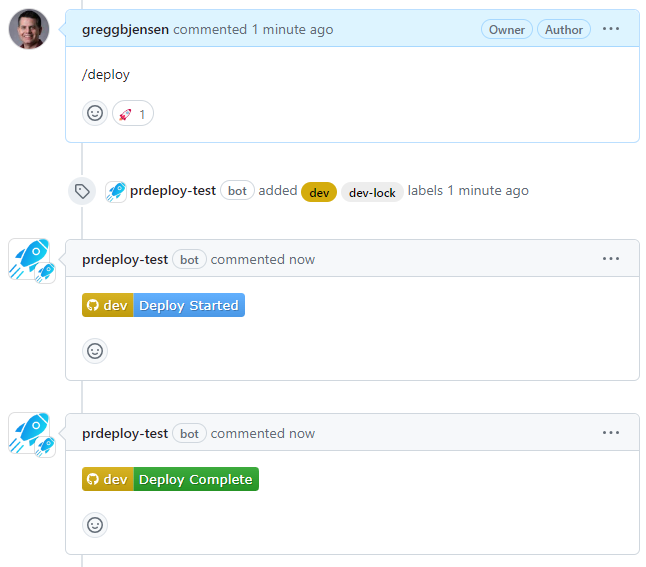
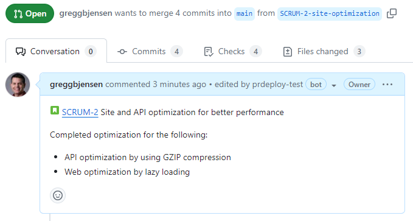

GitHub App that allows the entire build-deploy lifecycle to happen within a feature branch.  If any problems are found in the deployment, a new commit is done and rolled through without needing multiple PRs.

{: style="height:180px; display: block; margin: 0 auto 20px auto"}

Release multiple times per day with less issues.
{: style="text-align: center; color: #1192ec; margin: 0 0 70px 70px;"}

## Features

The **prdeploy** application supplies the following features:

### Commend commands

Post [comment commands](comment-commands.md) to manage your deployments without leaving your pull request.

{: style="margin: 30px 0;"}

### prdeploy portal

The [prdeploy portal](prdeploy-portal.md) dashboard to overview releases and deployment queues and act on them.

{: style="margin: 30px 0 60px 0; box-shadow: rgba(0, 0, 0, 0.2) 0px 3px 3px -2px, rgba(0, 0, 0, 0.14) 0px 3px 4px 0px, rgba(0, 0, 0, 0.12) 0px 1px 8px 0px;"}

### Microservice deploy

Using a **monorepo**, the [Microservice deploy](microservice-deploy.md) determines which services to deploy within a pull requests, and keeps each environment in sync with a stable release to production.

{: style="margin: 30px 0 30px 0; box-shadow: rgba(0, 0, 0, 0.2) 0px 3px 3px -2px, rgba(0, 0, 0, 0.14) 0px 3px 4px 0px, rgba(0, 0, 0, 0.12) 0px 1px 8px 0px;"}

### Slack notifications

Automated [Slack notifications](slack-notifications.md) for posting events to keep your process moving.

{: style="margin: 30px 0;"}

### JIRA links

Associate [JIRA links](jira-links.md) update your pull request with a link to each issue in the branch name.

{: style="margin: 30px 0 0 0;"}

### Deployment queues

The [deployment queues](deployment-queues.md) organize environment use by putting a pull request in waiting.

{: style="margin: 30px 0 0 0;"}

## Getting started

To get started with your own hosted **prdeploy** app, you can follow the [Getting started](getting-started/overview.md) section.
