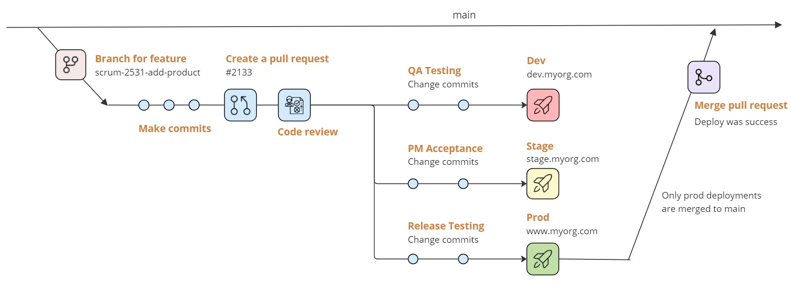

GitHub App that allows the entire build-deploy lifecycle to happen within a feature branch.  If any problems are found in the deployment, a new commit is done and rolled through without needing multiple PRs.

## Features

The **prdeploy** application supplies the following features:

1. [Comment commands](comment-commands.md) to manage your deployments without leaving your pull request.
2. [Slack notifications](slack-notifications.md) for posting events to keep your process moving.
3. [prdeploy portal](prdeploy-portal.md) dashboard to overview releases and deployment queues and act on them.

## Getting started

To get started with your own hosted **prdeploy** app, you can follow the [Getting started](getting-started/overview.md) section.
