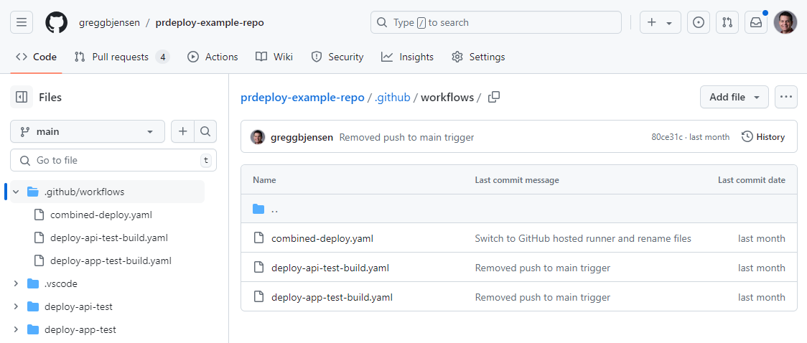
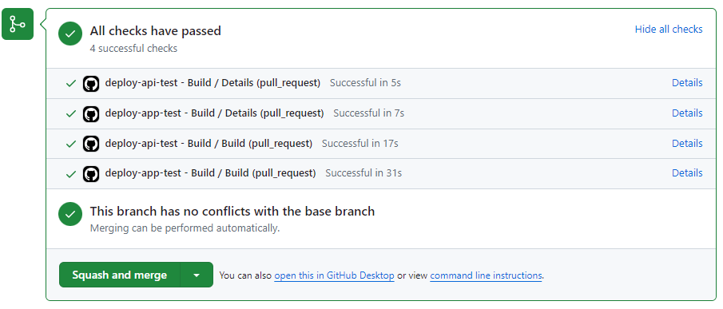
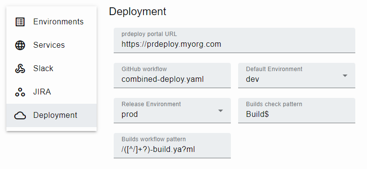

A big challenge of deploying microservices is making sure which services should be deployed together.  Often needing to click through multiple deployment pipelines to approve and roll them, or roll them back.  The **prdeploy** app manages this through the use of a **monorepo** and **GitHub Actions**.

## Monorepo setup

In the case of the **monorepo** for microservices, you will have multiple services in the root of the project as a folder.  As you can see here with the **deploy-api-test** and **deploy-app-test** services .


{: style="margin: 30px 0 30px 0; box-shadow: rgba(0, 0, 0, 0.2) 0px 3px 3px -2px, rgba(0, 0, 0, 0.14) 0px 3px 4px 0px, rgba(0, 0, 0, 0.12) 0px 1px 8px 0px;"}

## Microservice builds

For each of your services you would include a `my-service-build.yaml` workflow that builds the artifacts you need for deployment.  Each of these GitHub Action workflows should trigger based on your microservice path.

```yaml
name: prdeploy-api - build

on:
  pull_request:
    types:
      - opened
      - reopened
      - synchronize
      - ready_for_review
    branches:
      - main
    paths:
      - prdeploy-api/**
      - .github/workflows/prdeploy-api-build.yaml
```

These builds will also have a `build-details` artifact to your builds that includes a `build-details.json` file with at least the following data:

```json
{
  "version": "2023.11.30-r7040754105"
}
```

This can be done with the [greggbjensen/prdeploy/.github/actions/build-details](https://github.com/greggbjensen/prdeploy/blob/main/.github/actions/build-details/README.md#build-details-action) action.


## Deployment detection

As you modify code within your **monorepo** your pull request will automatically include checks that are those microservice builds.


{: style="margin: 30px 0 30px 0;"}

Using the **Builds check pattern** in **Settings**, **prdeploy** determines which checks are builds, rather than scans, linting, etc.


{: style="margin: 30px 0 30px 0;"}

## Combined deployment

Now that **prdeploy** has identified which services have changed by these checks, it can use one GitHub Actions `combined-deploy.yaml` workflow to deploy them.


{: style="margin: 30px 0 30px 0; box-shadow: rgba(0, 0, 0, 0.2) 0px 3px 3px -2px, rgba(0, 0, 0, 0.14) 0px 3px 4px 0px, rgba(0, 0, 0, 0.12) 0px 1px 8px 0px;"}

```yaml
on:
  workflow_dispatch:
    inputs:
      pull_number:
        description: 'Pull request number'
        type: string
        required: false
      environment:
        type: choice
        description: 'Deploy environment'
        options:
          - dev
          - stage
          - prod
      deploy_run_ids:
        description: 'IDs of builds to deploy'
        type: string
        required: true
      sync_run_ids:
        description: 'IDs of builds to sync'
        type: string
        required: false
      deploy_name:
        description: 'Deploy run name (automated)'
        type: string
        required: true
```

## Environment synchronization

We want to make sure that only the services that have changed are in the current environment, and all other services match your release or production environment exactly.  This is accomplished by using `deploy_run_ids` and `sync_run_ids` as inputs to the `combined-deploy.yaml` workflow.

The **prdeploy** app automatically tracks which versions of services are deployed in which environment to automatically synchronize the services you did not change and passes them in as the `sync_run_ids` input.


{: style="margin: 30px 0 60px 0; box-shadow: rgba(0, 0, 0, 0.2) 0px 3px 3px -2px, rgba(0, 0, 0, 0.14) 0px 3px 4px 0px, rgba(0, 0, 0, 0.12) 0px 1px 8px 0px;"}

## Single deployment approval

These features come together to allow your team to deploy or rollback sets of microservices within a single curated **Combined deploy** using your pull request comments such as `/deploy prod` and `/rollback prod`.  This also provides a full history of what happened and when within the pull request.


{: style="margin: 40px 0 10px 0;"}
