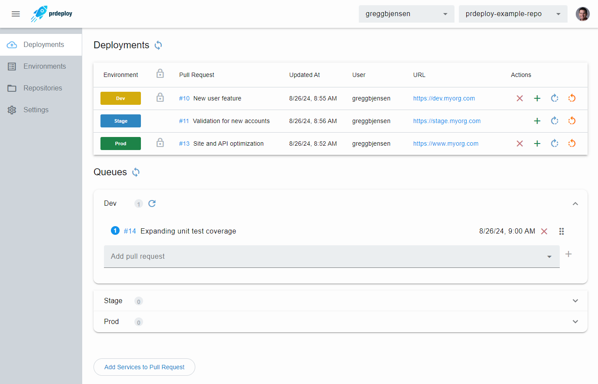
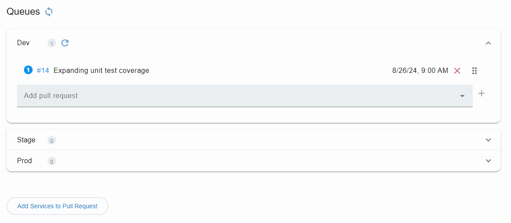

The **prdeploy** has a portal that uses your GitHub Login to be able to see all your environments and their pull requests, as well as manage the queues of waiting pull requests.  You can also execute all of the [comment commands](comment-commands.md) though an easy to use interface.

{: style="margin: 30px 0 60px 0; box-shadow: rgba(0, 0, 0, 0.2) 0px 3px 3px -2px, rgba(0, 0, 0, 0.14) 0px 3px 4px 0px, rgba(0, 0, 0, 0.12) 0px 1px 8px 0px;"}

## Run comment commands

From the **Deployments** grid, you can click the actions to run comment commands directly.

{: style="margin: 30px 0 20px 0;"}

## Manage environment queue

From the **Queues** list, you can reorder, add to, and delete from the current queue to optimize your use of the environment.

{: style="margin: 30px 0 20px 0;"}

## Compare environments

The **Environments** page allows you compare versions of services accross environments.

{: style="margin: 30px 0 60px 0; box-shadow: rgba(0, 0, 0, 0.2) 0px 3px 3px -2px, rgba(0, 0, 0, 0.14) 0px 3px 4px 0px, rgba(0, 0, 0, 0.12) 0px 1px 8px 0px;"}

## Manage repositories

With the **Repositories** page, you can configure new or remove existing repositories to use **prdeploy** with.

{: style="margin: 30px 0 60px 0; box-shadow: rgba(0, 0, 0, 0.2) 0px 3px 3px -2px, rgba(0, 0, 0, 0.14) 0px 3px 4px 0px, rgba(0, 0, 0, 0.12) 0px 1px 8px 0px;"}

## Configure settings

In the **Settings** page, your **Environments**, **[JIRA](jira-links.md)**, and **[Slack](slack-notifications.md)** integrations can be managed.  You can also adjust your **Deployment** settings.  Settings can be set at the **Organization** level for all repositories, then overriden for individual **Repositories** as needed.

{: style="margin: 30px 0 60px 0; box-shadow: rgba(0, 0, 0, 0.2) 0px 3px 3px -2px, rgba(0, 0, 0, 0.14) 0px 3px 4px 0px, rgba(0, 0, 0, 0.12) 0px 1px 8px 0px;"}

### Environments

Configure all of your available environments, if they should always be up to date, and if there is a gate to approve them.

{: style="margin: 30px 0 60px 0;"}

### Services

Setting up your services allows you to add specific ones to your pull request with the comment `/add my-service` when it is not detected to include automatically.

{: style="margin: 30px 0 60px 0;"}

### Slack

In the **Slack** section you can specify your settings for posting deploy and release notifications.  You can also alias email addresses to the correct Slack email if they are incorrect.

{: style="margin: 30px 0 60px 0;"}

### JIRA

Configuring **JIRA** allows **prdeploy** to be able to automatically link issues to your pull request.

{: style="margin: 30px 0 60px 0;"}

### Deployment

With the **Deployment** section you can adjust your default and release environment, as well as the colors to post in comments for status.  It is also important to set your **prdeploy portal URL** so the comment badges can link to the portal.

{: style="margin: 30px 0 60px 0;"}

