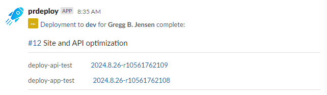

The **prdeploy** app posts notifications for both deployments and releases.

## Deployments

Each time a deployment to any environment is completed, the author of the pull request is notified in a Slack channel.

{: style="margin: 30px 0;"}

## Releases

When a deployment is completed to the release environment, such as **Production**, the release notes are posted in a Slack channel.

{: style="margin: 30px 0;"}